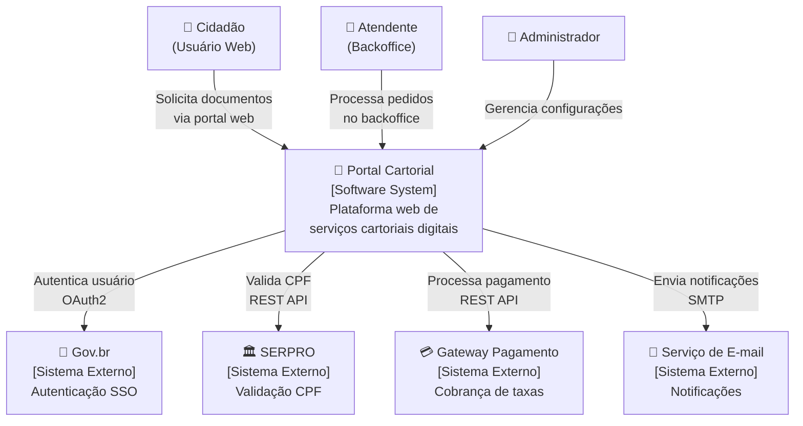
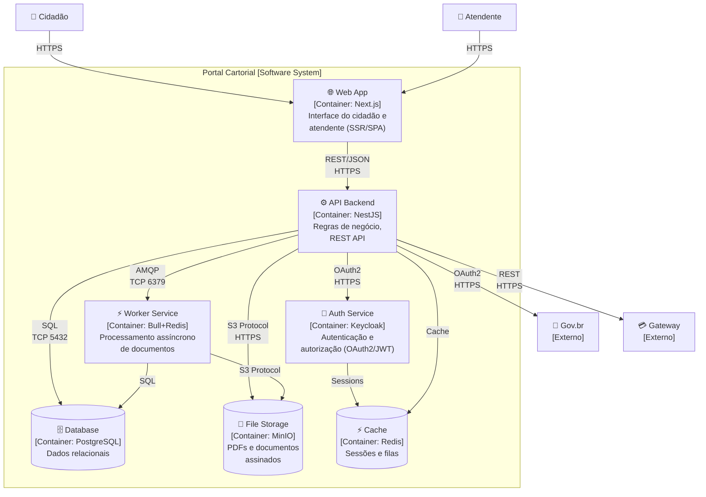
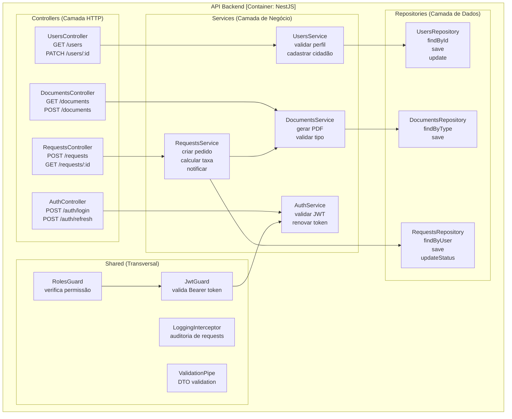

# Portal Cartorial

> Plataforma web para solicitação e gestão de serviços cartoriais digitais.
> Projeto exemplo da disciplina **Práticas de Engenharia de Software — TADS 2026.1**

[](https://github.com/seu-squad/portal-cartorial/actions)

---

## Sumário

- [Descrição do sistema](#descrição-do-sistema)
- [Arquitetura — C4 Model](#arquitetura--c4-model)
- [Stack tecnológica](#stack-tecnológica)
- [Como rodar localmente](#como-rodar-localmente)
- [Estrutura do projeto](#estrutura-do-projeto)
- [Documentação de decisões arquiteturais](#decisões-arquiteturais-adr)

---

## Descrição do sistema

O **Portal Cartorial** permite que cidadãos solicitem certidões, reconhecimento de firma e
demais serviços cartoriais de forma 100% digital. Atendentes do cartório processam os pedidos
por um backoffice integrado, com autenticação via Gov.br (SSO) e pagamento por gateway externo.

**Usuários:**
| Persona | Descrição |
|---|---|
| Cidadão | Solicita documentos e acompanha pedidos via portal web |
| Atendente | Processa, valida e emite documentos no backoffice |
| Administrador | Gerencia usuários, preços e configurações do sistema |

---

## Arquitetura — C4 Model

### C1 — System Context



### C2 — Container Diagram



### C3 — Component Diagram (API Backend)



---

## Stack Tecnológica

| Container | Tecnologia | Versão | Justificativa |
|---|---|---|---|
| Web App | Next.js (React) | 14 | SSR para SEO + SPA para interatividade |
| API Backend | NestJS (Node.js) | 10 | Estrutura modular, TypeScript nativo, decorators |
| Auth Service | Keycloak | 23 | OAuth2/OIDC enterprise, integra Gov.br |
| Database | PostgreSQL | 16 | Dados relacionais com ACID + suporte JSON |
| File Storage | MinIO | latest | S3-compatible, self-hosted para LGPD |
| Cache / Queue | Redis | 7 | Filas (Bull) + cache de sessão |
| Worker | Bull (Node.js) | 4 | Processamento assíncrono de PDFs |

---

## Como rodar localmente

### Pré-requisitos
- Docker Desktop 4.x+
- Node.js 20+
- npm 10+

### 1. Clone e configure variáveis de ambiente

```bash
git clone https://github.com/seu-squad/portal-cartorial.git
cd portal-cartorial
cp .env.example .env
# Edite .env com suas configurações locais
```

### 2. Suba a infraestrutura com Docker Compose

```bash
docker compose up -d
# PostgreSQL, Redis, MinIO e Keycloak sobem automaticamente
```

### 3. Instale dependências e rode o backend

```bash
cd backend
npm install
npm run migration:run
npm run seed
npm run start:dev
# API disponível em http://localhost:3000
# Swagger em http://localhost:3000/api/docs
```

### 4. Instale dependências e rode o frontend

```bash
cd frontend
npm install
npm run dev
# App disponível em http://localhost:3001
```

### URLs locais

| Serviço | URL |
|---|---|
| Frontend | http://localhost:3001 |
| API (Swagger) | http://localhost:3000/api/docs |
| Keycloak Admin | http://localhost:8080 |
| MinIO Console | http://localhost:9001 |
| Redis (via RedisInsight) | localhost:6379 |

---

## Estrutura do Projeto

```
portal-cartorial/
├── backend/                    # C2: API Backend [NestJS]
│   ├── src/
│   │   ├── modules/
│   │   │   ├── auth/           # C3: Autenticação e autorização
│   │   │   ├── users/          # C3: Gestão de usuários/cidadãos
│   │   │   ├── documents/      # C3: Tipos e templates de documentos
│   │   │   └── requests/       # C3: Pedidos de serviços cartoriais
│   │   ├── shared/             # Guardas, interceptores, pipes globais
│   │   └── config/             # Configuração da aplicação
│   └── test/                   # Testes unitários e de integração
├── frontend/                   # C2: Web App [Next.js]
│   └── src/
│       ├── app/                # Rotas (App Router do Next.js 14)
│       ├── components/         # Componentes reutilizáveis
│       ├── hooks/              # Custom React Hooks
│       ├── services/           # Clients da API
│       └── types/              # Tipos TypeScript compartilhados
├── docs/
│   └── architecture/
│       ├── decisions/          # ADRs (Architecture Decision Records)
│       └── images/             # Diagramas exportados
├── infra/                      # Docker, scripts de banco
├── .github/workflows/          # Pipelines CI/CD
├── docker-compose.yml          # C2: todos os containers
└── .env.example
```

---

## Decisões Arquiteturais (ADR)

| # | Decisão | Status |
|---|---|---|
| [ADR-001](docs/architecture/decisions/ADR-001-nextjs-ssr.md) | Usar Next.js com SSR | Aceito |
| [ADR-002](docs/architecture/decisions/ADR-002-nestjs-backend.md) | Usar NestJS para API | Aceito |
| [ADR-003](docs/architecture/decisions/ADR-003-postgresql-database.md) | PostgreSQL vs MongoDB | Aceito |
| [ADR-004](docs/architecture/decisions/ADR-004-keycloak-auth.md) | Keycloak para autenticação | Aceito |

---

*Prof. Marcio Goes do Nascimento — Práticas de Engenharia de Software · TADS 2026.1*
